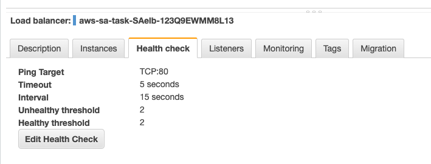
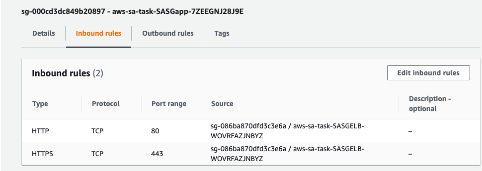
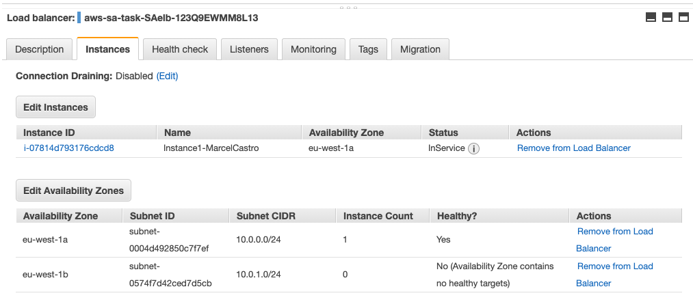
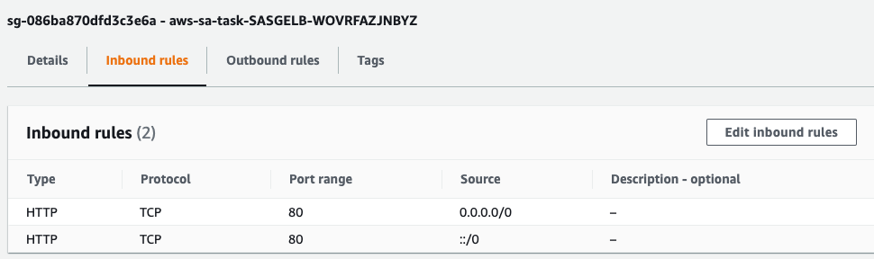

# aws-sa-task
Repository to capture aws task to troubleshoot the use of elastic load balancer and ec2.  

# Scenario:

Customer has launched an AWS Elastic Load Balancer (ELB) and an Amazon Elastic Compute Cloud (EC2) instance acting as the web server. Both are deployed in a Virtual Private Cloud (VPC) on AWS. While your customer's initial deployment aims to present a static web page to its users (**demo.html** located in the document root of the web server), the end solution should continue to be suitable for generating dynamic responses (your customer is currently developing the application). The customer is not sure about their future direction or requirements and are looking to you to provide expert guidance despite the ambiguity. 

You are contacted and asked to: 

a) Troubleshoot the implementation by doing the minimum amount of work required to make the web site operational. Your customer expects detailed written troubleshooting instructions or scripts for the in-house team. 

b) Propose short term changes you could help them implement to improve the availability, security, reliability, cost and performance before the project goes into production. Your customer expects you to explain the business and technical benefits of your proposals, with artifacts such as a design or architecture document and diagrams. 

c) Optionally, propose high level alternative solution(s) for the longer term as their web application becomes more successful. 

## Instructions

1. Launch the provided CloudFormation template in the **eu-west-1 (Ireland)** region. Once the environment is launched, identify why the content of the web site is not being displayed through the load balancer's hostname. The DNS name of the Elastic Load Balancer will appear in the CloudFormation Outputs tab. Please note that you will **not** be required to log on to the web server to resolve the issues. 
2. Prepare a short and concise document (not presentation slides) describing your solutions to problems a), b) and c). Feel free to add architecture diagrams, screenshots or other artifacts in addition to your document. Please describe your solution(s) and respective deployment steps as you would to a real customer. 
3. Email your document back to the Recruitment Coordinator you received it from, with your Recruiter in CC. Please **do not** share any credentials of your own AWS account with us. 
4. Your assignment is complete. We will review your document prior to the interview. 
5. Important: in order to avoid incurring unnecessary charges to your AWS account you should delete the CloudFormation stack and terminate any other resources launched in relation to this exercise. Feel free to do that as soon as you have submitted your document and before your interview. 

**Task 1: Identify why the content of the web site is not being displayed through the load balancer's hostname**

STAR (Situation, Task, Action and Result)

Situation: A static webpage from a customer has been launched an AWS Elastic Load Balancer (ELB) and an Amazon Elastic Compute Cloud (EC2) instance acting as the web server based on the CloudFormation template. 

| Actions                                                      | Screensshot                                                  |
| ------------------------------------------------------------ | ------------------------------------------------------------ |
| 1) Health check of load balancer changed to TCP:80.          |  |
| 2) Add Inboud rule to Application security group (SASapp) where EC2 is located in order to allow load balancer to generate heathy check towards EC2. The rule should allow TCP:80 traffic coming from SASELB security group. |  |
| 3) Add eu-west-1a (subnet 10.0.0.0/24) to the ELB availability zones. |  |
| 4) Add Inbound rule to ELB security group (SASELB) to allow HTTP traffic (TCP:80) from anywhere to reach the elastic load balancer. |  |

Reference:

[1]: https://getcft.com/elb-to-ec2-target-group-cloudformation-template/

Other solutions:

- AWS CDK: https://github.com/aws-samples/aws-cdk-examples/tree/master/python/classic-load-balancer
- 
