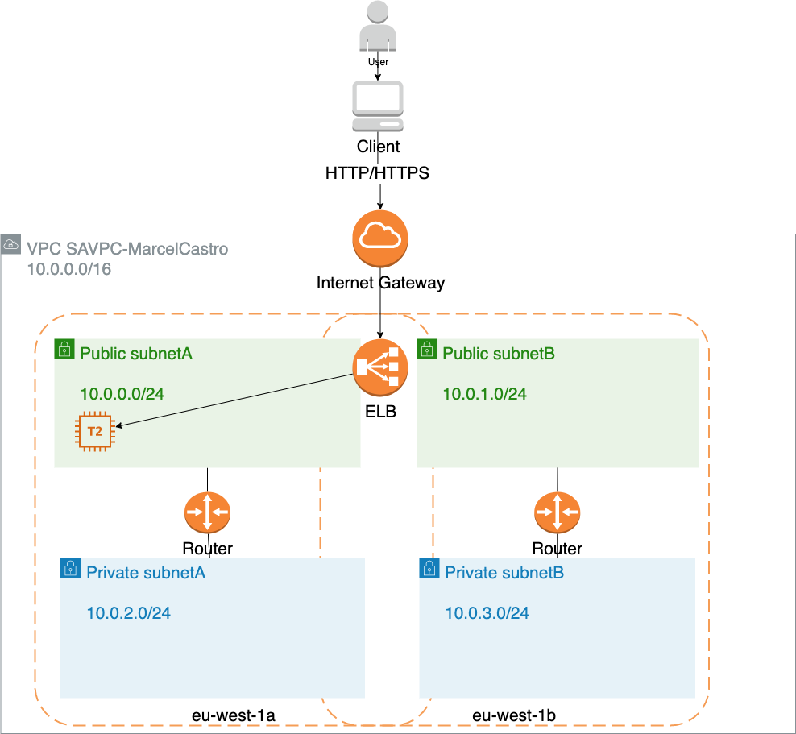
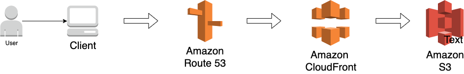
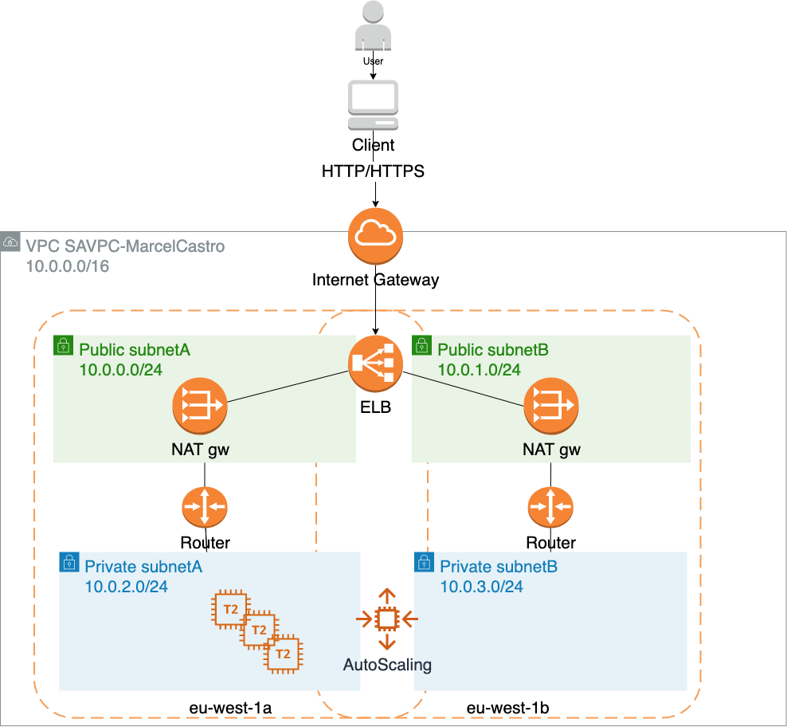
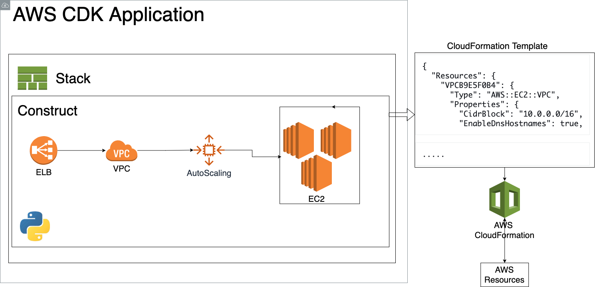
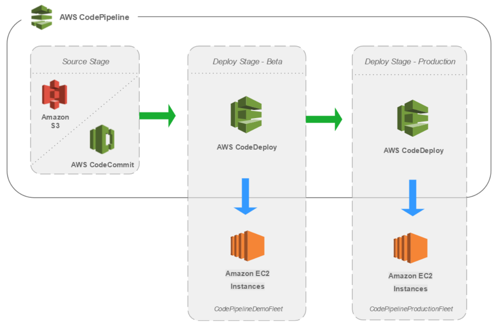
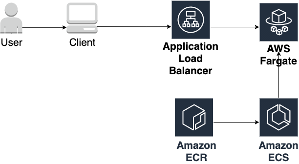
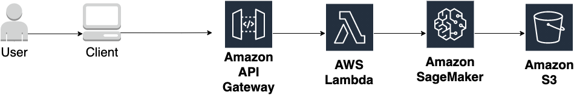

# AWS Solution Architect - Assignment
Repository to capture AWS task related to the AWS Solution Architect Assignment to troubleshoot the CloudFormation template composing a web application using elastic load balancer and EC2 instances.

Author: Marcel Cavalcanti de Castro

Address: marcelcastrobr@gmail.com

Github repository including code: https://github.com/marcelcastrobr/aws-sa-task 

Version: 02 (2021/06/07): Added Suggestion 3: Web application using AWS Fargate as described in [here](https://github.com/aws-samples/aws-modern-application-workshop).

# Scenario and Tasks:

A customer has launched an AWS Elastic Load Balancer (ELB) and an Amazon Elastic Compute Cloud (EC2) instance acting as the web server. Both are deployed in a Virtual Private Cloud (VPC) on AWS. While your customer's initial deployment aims to present a static web page to its users (**demo.html** located in the document root of the web server), the end solution should continue to be suitable for generating dynamic responses (your customer is currently developing the application). The customer is not sure about their future direction or requirements and are looking to you to provide expert guidance despite the ambiguity. 

You are contacted and asked to: 

a) Troubleshoot the implementation by doing the minimum amount of work required to make the web site operational. Your customer expects detailed written troubleshooting instructions or scripts for the in-house team. 

b) Propose short term changes you could help them implement to improve the availability, security, reliability, cost and performance before the project goes into production. Your customer expects you to explain the business and technical benefits of your proposals, with artifacts such as a design or architecture document and diagrams. 

c) Optionally, propose high level alternative solution(s) for the longer term as their web application becomes more successful. 


### Instructions

1. Launch the provided [CloudFormation template](https://github.com/marcelcastrobr/aws-sa-task/blob/main/AWS-SA-CloudFormation-v20190724.yaml) in the **eu-west-1 (Ireland)** region. Once the environment is launched, identify why the content of the web site is not being displayed through the load balancer's hostname. The DNS name of the Elastic Load Balancer will appear in the CloudFormation Outputs tab. Please note that you will **not** be required to log on to the web server to resolve the issues. 

2. Prepare a short and concise document (not presentation slides) describing your solutions to problems a), b) and c). Feel free to add architecture diagrams, screenshots or other artifacts in addition to your document. Please describe your solution(s) and respective deployment steps as you would to a real customer. 


# Solutions

In this sections we present the solutions to the three different tasks described above (tasks a, task b and task c)

### Task a : Troubleshoot the implementation by doing the minimum amount of work required to make the web site operational. 

**Situation:** A static webpage from a customer has been launched using an AWS Elastic Load Balancer (ELB) and an Amazon Elastic Compute Cloud (EC2) instance acting as the web server based on the [CloudFormation template](https://github.com/marcelcastrobr/aws-sa-task/blob/main/AWS-SA-CloudFormation-v20190724.yaml). The customer is not able to reach the web server. The content of the web site is not being displayed through the load balancer's hostname using the LoadBalancerDNSName (e.g. http://aws-sa-task-saelb-123q9ewmm8l13-1715858296.eu-west-1.elb.amazonaws.com/) nor using the EC2 public IPv4 address or public EC2 IPv4 DNS. 

**Task:** The task is to find why the content of the website is not been displayed. The architecture drawing based on the received CloudFormation template is depicted in the figure below:



**Action:** Through the deployment of the CloudFormation template, I found out that 1) the EC2 instance running the web server was part of the security group SASapp. But the security group did not have an inbound rule allowing the ELB to connect to the EC2. A new inbound rule were created (see action 2 below).  In addition, we need to include the public subnet eu-west-1a zone to the availability zone of the ELB (action 3). Thus, after updating the SASapp security group inbound rule (action 2), include the eu-west-1a zone to the ELB (action 3) and modifying the ELB health check to TCP:80 (action 1), the status of the EC2 instance on the ELB became "InService". 

To make sure we were able to reach the web server through the ELB, we also need to include the inbound rule on the ELB security group (SASELB) to allow HTTP traffic on port 80 from the internet to the ELB (action 4 below).

**Result:** After performing actions 1 to 4, we were able to reach the web server via the ELB.

 

| Actions                                                      | Screensshot                                                  |
| ------------------------------------------------------------ | ------------------------------------------------------------ |
| 1) Health check of load balancer changed to TCP:80.          |  |
| 2) Add Inboud rule to Application security group (SASapp) where EC2 is located in order to allow load balancer to generate heathy check towards EC2. The rule should allow TCP:80 traffic coming from SASELB security group. |  |
| 3) Add eu-west-1a (public subnet 10.0.0.0/24) to the ELB availability zones. |  |
| 4) Add Inbound rule to ELB security group (SASELB) to allow HTTP traffic (TCP:80) from anywhere to reach the elastic load balancer. |  |


### Task b : Short term to improve the availability, security, reliability, cost and performance before the project goes into production. 

*Your customer expects you to explain the business and technical benefits of your proposals, with artifacts such as a design or architecture document and diagrams.*

Two possible scenarios are depicted below. 

The Scenario 1 is suited for static web sites solution and composed by:

- Amazon S3: where the static website files are stored in a S3 bucket. 
- CloudFront: to serve our static files from various location using S3 as origins. 
- Route 53: used as a DNS service and helps users to resolve the web site address.

The Scenario 2 is suited for dynamic web sites solution and it is an extension of the CloudFormation template provided in Task a above. Scenario 2 main building blocks are:

- Amazon VPC: The solution in this scenario makes use of an AWS Virtual Private Cloud in order to allow us to launch resources in a logically isolated virtual network. 
- Security groups and subnets: Two security groups are created, one for ELB and another for the Application/EC2 instances. This allows us to moves security to the instance to provide host-level firewall for the web application servers. In this scenario, the ELB security group allows access for any host only over TCP on port 80 and 443 (HTTP and HTTPS) coming from the internet. On the other hand, the Application/EC2 security group only allows access to the EC2 instances coming from the ELB.
- Elastic Load Balancer (ELB): is deployed on the public subnets and redirects traffic to the Amazon EC2 instances deployed on the private subnets. The ELB allows us to spread the load across multiple availability zones and Amazon EC2 auto scaling groups for redundancy. ELB also supports heath checks on hosts and consequently the dynamic addition and removal of Amazon EC2 hosts from the load-balancing rotation. 
- AutoScaling: allows the monitoring of the application. It automatically adjust the amount of EC2 instances needed in order to maintain the steady and predictable application load. A minimum and maximum amount of EC2 instance can be configured in order to limit the amount of instance used. 


| Scenario 1                                                   | Scenario 2                                                   |
| ------------------------------------------------------------ | ------------------------------------------------------------ |
|  |  |

In addition, the points below are further points to be considered on Scenario 2 as a way to improve the availability, security, cost and performance as suggested by the five pillars of the [AWS Well-Architected Framework.](https://docs.aws.amazon.com/wellarchitected/latest/framework/the-five-pillars-of-the-framework.html)

- Deploy EC2 instances at the private networks, protected from the internet. Furthermore, keep ELB connected to the public subnet in the same availability zone as the private subnet which the EC2s are registered [ref [here](https://aws.amazon.com/premiumsupport/knowledge-center/public-load-balancer-private-ec2/)].
- Use CloudWatch in order to monitor, alert, and audit actions and changes to your environment in real time.

- Make use of application load balancer instead of classical load balancer in order to allow the route of traffic based on the content (e.g. support of path based routing and sticky sessions) and use of dynamic port mapping in case the use of ECS (Elastic Container Service) is preferred.

- Add AutoScaling group with a minimum desired capacity of at least 2 instances within the two availability zones. This would allow better fault tolerance in case an instance became unhealthy or has been terminated accidentally. By also configuring the EC2 auto scaling to use multiple availability zones (AZs), you guarantee that your web server application is available at all time even if an AZ becomes unavailable.  EC2 Auto Scaling will also help on the cost management as the amount of instances can increase and decrease capacity dynamically  as needed.
- Consider the use of disaster recovery scenarios such as Backup and Recovery, pilot light and warm standby.

### Task 1c: High level alternative solution for the web application

In this section, two suggestions are proposed in order to arrive in a longer term solution for the web application to become more successful. The first suggestion is the use of AWS Cloud Development Kit to automatically deploy resources on AWS. The second suggestion is to make sure we are able to setup a  continuous integration and continuous delivery (CI/CD) pipeline in order to deploy fast and reliable application and infrastructure updates.

#### Suggestion 1: AWS CDK - Infrastructure as a Code.

AWS Cloud Development Kit (AWS CDK) is a software development framework for defining cloud infrastructure in code and provisioning it through AWS CloudFormation. AWS CDK with the help of CloudFormation would enable us to:

- Create and provision AWS infrastructure deployments predictably and repeatedly.
- Leverage AWS products such as Amazon EC2, Elastic Load Balancing, and Auto Scaling as "infrastructure as a code".

The picture below provides an illustration on how the web server application example using CDK can be  deployed.



The solution described in Scenario 2 of Task b was implemented in CDK and it is available at GitHub link: https://github.com/marcelcastrobr/aws-sa-task/tree/main/aws-cdk/sample_webapp for use.  In this implementation, we are using python as the programming language.

**How to run the AWS CDK example:**

Step 1: You will need to install AWS CLI, AWS CDK toolkit and Python. Reference to the https://cdkworkshop.com/15-prerequisites.html. Please make sure you install AWS CDK version 2.

Step 2: Create a project directory:

```bash
$ mkdir sample_webapp & cd sample_webapp
```

Step 3: cdk init

```bash
$ cdk init sample-app --language python	
```

 Step 4: Activate your virtual environment

```bash
$ python3 -m venv .venv
$ source .venv/bin/activate
$ pip install -r requirements.txt
```

Step 5: clone the GitHub repository with the AWS CDK code and copy the implementation to your newly created CDK directory

```bash
$ git clone https://github.com/marcelcastrobr/aws-sa-task.git
$ cp aws-sa-task/sample_app/sample_app/sample_app_stack.py sample_webapp/sample_webapp_stack.py
$ cp aws-sa-task/sample_app/httpd.sh sample_webapp/
```

 Step 6: Synthetize your stack

```bash
$ cdk synth
```

Step 7: Bootstrapping an environment

```bash
$ cdk bootstrap
```

Step 8: Deploy CDK application 

```bash
$ cdk deploy sample_webapp
```

Congratulations, your application is deployed in AWS.


Step 9: Clean up your stack

```bash
$ cdk destroy
```


#### Suggestion 2: Implement continuous integration and continuous delivery (CI/CD) pipeline

To make sure you can automate your software delivery process, it is highly recommend to use continuous integration and continuous delivery (CI/CD) pipeline to your application. A pipeline helps you automate steps in your software delivery process, such as initiating automatic builds and then deploying to Amazon EC2 instances. The picture below presents the high level architecture for a AWS CICD solution using AWS CodePipeline, a service that builds, tests, and deploys your code every time there is a code change, based on the release process models you define. 

Use CodePipeline to orchestrate each step in your release process. As part of your setup, you will plug other AWS services into CodePipeline to complete your software delivery pipeline. Please check [CodePipeline tutorial](https://docs.aws.amazon.com/codepipeline/latest/userguide/tutorials.html) for examples.



Picture by [AWS](https://d1.awsstatic.com/Projects/CICD Pipeline/setup-cicd-pipeline2.5cefde1406fa6787d9d3c38ae6ba3a53e8df3be8.png) 


#### Suggestion 3: Dynamic Website using AWS Fargate

Another option while designing a modern web application is through the use of containers through AWS Fargate. AWS Fargate is a deployment option in Amazon ECS (Elastic Container Service) that allow us to deploy containers without having to manage any cluster or servers. For the example provided in the github repository, we used the code in Reference [8], which is composed by a Flask application in a docker container behind an Application Load Balancer. 




**How to deploy Flask application through AWS Fargate using AWS CDK :**


**Step 1:** 	Create Fask application (i.e. docker container with application) and push the docker image created to AWS ECR

Within sample_webapp_fargate/app:

```bash
docker build . -t $(aws sts get-caller-identity --query Account --output text).dkr.ecr.$(aws configure get region).amazonaws.com/mythicalmysfits/service:latest

```

We can test the service locally by:

```bash
docker run -p 8080:8080 $(aws sts get-caller-identity --query Account --output text).dkr.ecr.$(aws configure get region).amazonaws.com/mythicalmysfits/service:latest

```

You can check the response of the container by navigating locally the url http://0.0.0.0:8080/.

Push the docker image to Amazon ECR using the following commands:

```bash
aws ecr get-login-password | docker login --username AWS --password-stdin $(aws sts get-caller-identity --query Account --output text).dkr.ecr.$(aws configure get region).amazonaws.com

docker push $(aws sts get-caller-identity --query Account --output text).dkr.ecr.$(aws configure get region).amazonaws.com/mythicalmysfits/service:latest
```

You can check the pushed docker imaged stored in ECR through the command:

```bash
aws ecr describe-images --repository-name mythicalmysfits/service
```


**Step 2:** Deploy the Application Load Balancer and AWS Fargate using CDK

The CDK application created has two stacks. The first one is the MyEcrConstructStack which creates an Amazon ECR repository and the other stack is the MyEcsConstructStack which create the Amazon ECS service with AWS Fargate.

First we create an Amazon ECR repository using:

```bash
cdk synth MyEcrConstructStack
```

Second, you can use the command below to deploy the  ECS stack which is responsible to create a cluster in ECS.

```
cdk synth MyEcsConstructStack 
```

After deploying both stacks you should be able to test the service using the command:

```bash
curl http://<replace-with-your-elb-address>/mysfits
```


#### Suggestion 3.1: Using Machine Learning to Recommend an item on your website.

Machine learning is a growing area of attention due to its capability to learn patters and support decision or recommendations based on previous data.

With Amazon SageMaker, a managed services for machine learning, we can use machine learning models for recommendation systems. 

In the example provided with stack name [MySagemakerConstructStack](https://github.com/marcelcastrobr/aws-sa-task/blob/main/aws-cdk/sample_webapp_fargate/MyEcsApplication/my_sagemaker_construct/my_sagemaker_construct_stack.py) I have used the KNN machine learning model to implement the Mysfit recommendation from the [AWS Modern Application Workshop example](https://github.com/aws-samples/aws-modern-application-workshop/tree/python-cdk/module-7) .

Here SageMaker is used to:

- Train the model using a Jupiter Notebook
- Store and deploy the model as a SageMaker endpoint.

In addition a Serverless REST API using API Gateway and AWS Lambda  is used to interact with the SageMaker endpoint deployed.





The AWS CDK stack can be deployed by running the following command:

```bash
cdk deploy MySagemakerConstructStack
```


The API Gateway endpoint pointing to the Amazon SageMaker through the lambda function can be tested using the following curl command:

```bash
curl -d '{"entry": [1,2,3,4,5]}' REPLACE_ME_RECOMMENDATION_API_ENDPOINT/recommendations -X POST
```


## Additional References:

1. [AWS Well-Architected Framework](https://aws.amazon.com/architecture/well-architected/?wa-lens-whitepapers.sort-by=item.additionalFields.sortDate&wa-lens-whitepapers.sort-order=desc)
2. [AWS Elastic Load Balancer](https://aws.amazon.com/elasticloadbalancing/?whats-new-cards-elb.sort-by=item.additionalFields.postDateTime&whats-new-cards-elb.sort-order=desc)
3. [AWS EC2](https://aws.amazon.com/ec2/)
4. [AWS CloudFormation](https://aws.amazon.com/cloudformation/)
5. [AWS CDK](https://aws.amazon.com/cdk/)
6. [AWS CDL Examples](https://github.com/aws-samples/aws-cdk-examples/tree/master/python/classic-load-balance)
7. [AWS Withepaper: Web Application Hosting in the AWS Cloud: Best Practices](https://docs.aws.amazon.com/whitepapers/latest/web-application-hosting-best-practices/web-application-hosting-best-practices.pdf)
8. [Projects on AWS: Build Modern Web Application]()
9. [AWS Whitepaper: Introduction to DevOps on AWS](https://docs.aws.amazon.com/whitepapers/latest/introduction-devops-aws/continuous-integration.html)

