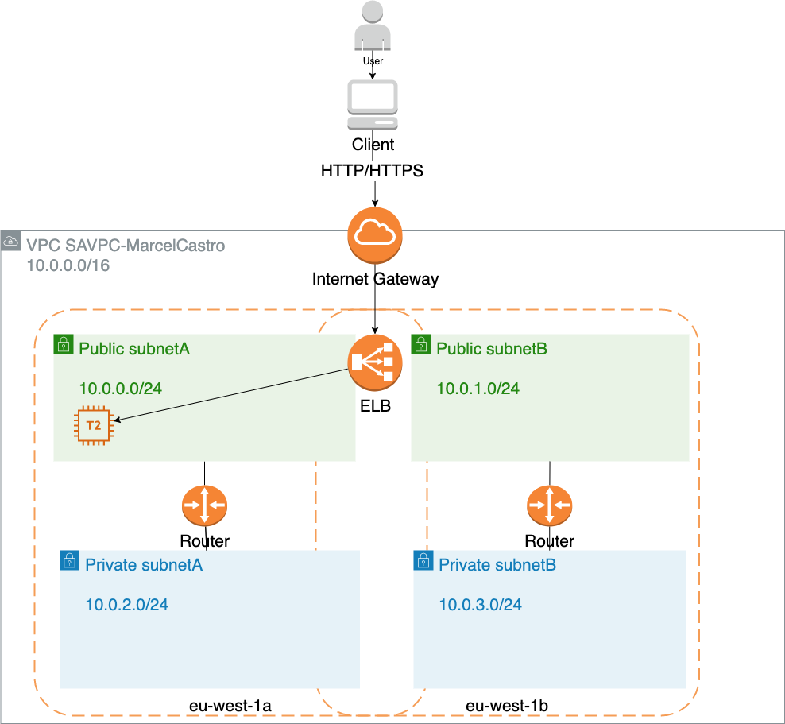
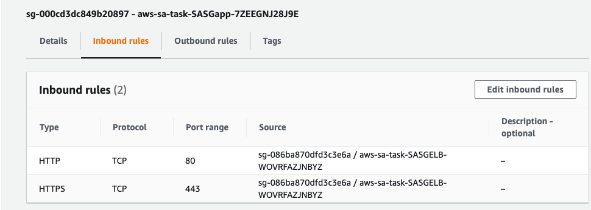
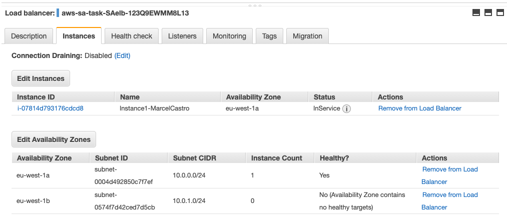
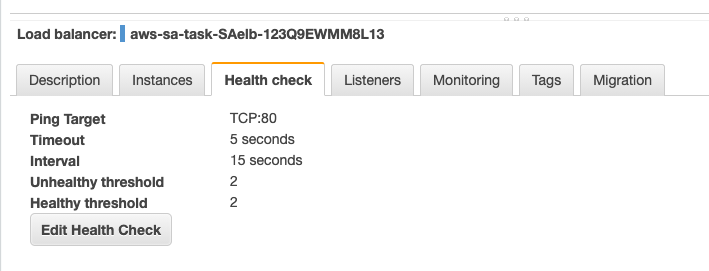
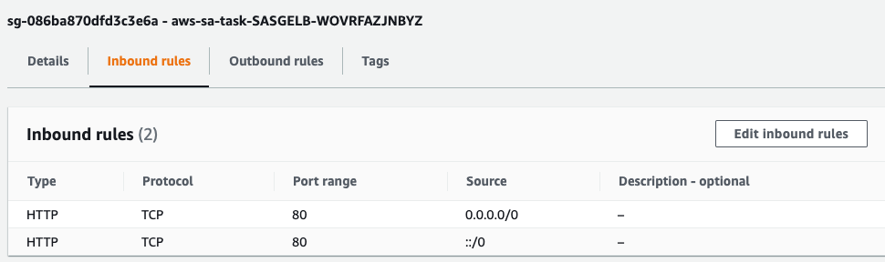
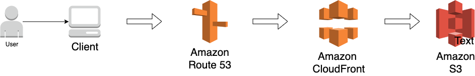
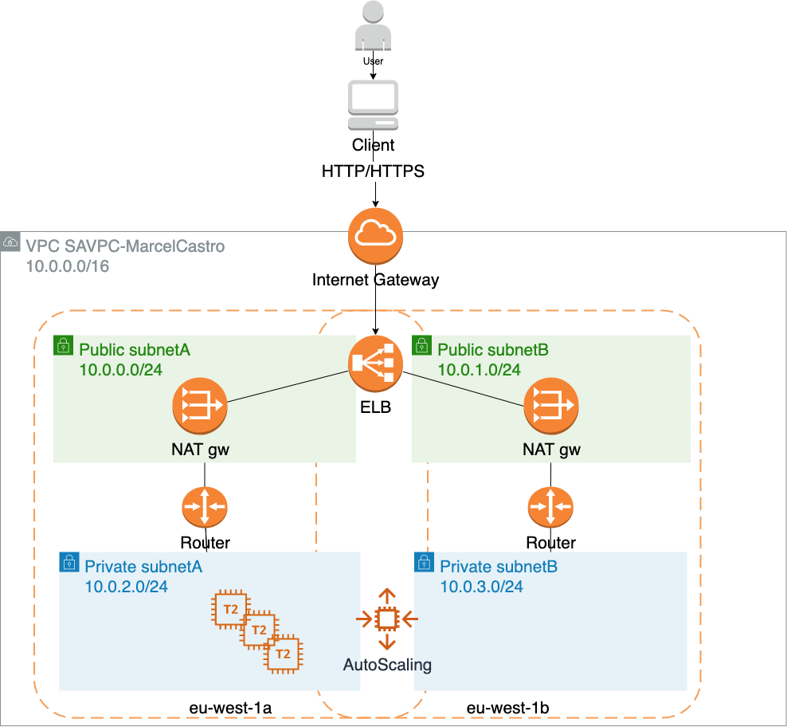
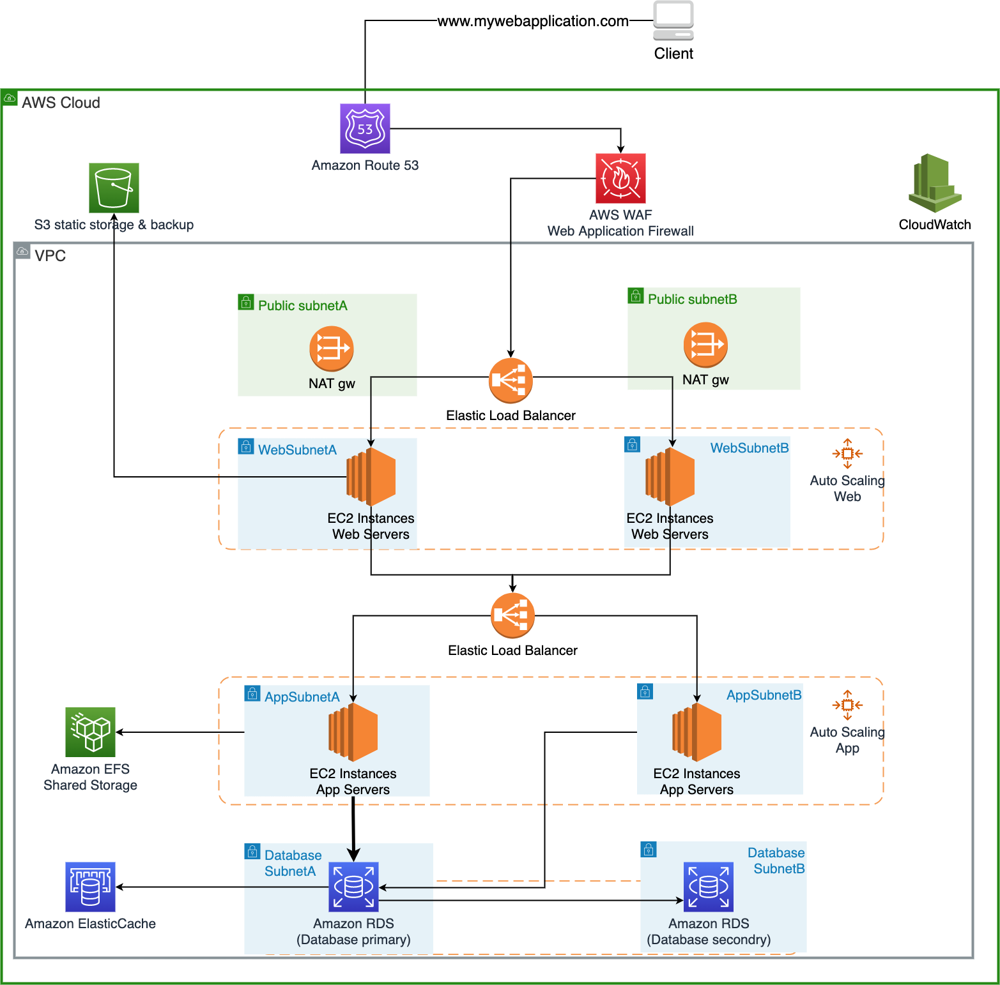
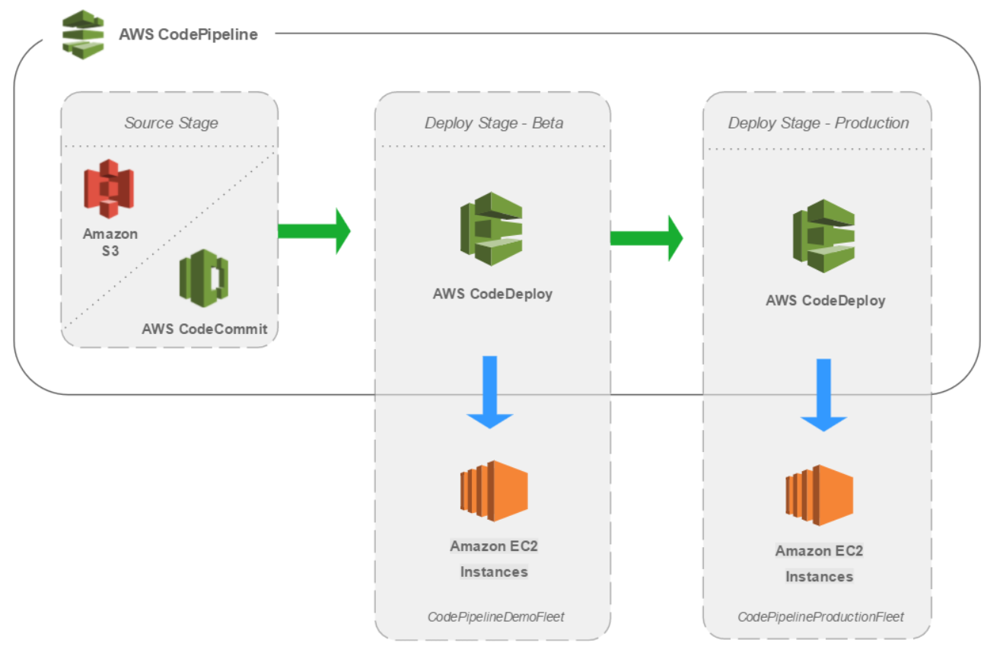

# AWS Solution Architect - Assignment

Repository to capture AWS task related to the AWS Solution Architect Assignment to troubleshoot the CloudFormation template for AWS assignment version 20210713174618-856cd12. 

Author: Marcel Cavalcanti de Castro

Address: marcelcastrobr@gmail.com

Version: 03 (05.04.2022): updates to the long term solution.


# Scenario and Tasks:

In the exercise scenario, you play the role of a freelancer. Your (imagined) customer has not used AWS before, and is encountering issues when trying to launch a web application as a proof of concept.

So far your customer has launched an AWS Elastic Load Balancer (ELB) and an Amazon Elastic Compute Cloud (EC2) instance acting as the web server. Both are deployed in a Virtual Private Cloud (VPC) on AWS. While your customer’s initial deployment aims to present a static web page to its users (**demo.html** located in the document root of the web server), the end solution should continue to be suitable for generating dynamic responses (your customer is currently developing the application). The customer is not sure about their future direction or requirements and are looking to you to provide expert guidance despite the ambiguity.

### Instructions

You are contacted and asked to:

**Task a)** Troubleshoot the implementation by doing the minimum amount of work required to make the web site operational. Your customer expects detailed written troubleshooting instructions or scripts for the in-house team.

**Task b)** Propose short term changes you could help them implement to improve the availability, security, reliability, cost and performance before the project goes into production. Your customer expects you to explain the business and technical benefits of your proposals, with artifacts such as a design or architecture document and diagrams.

**Task c)** Optionally, propose high level alternative solution(s) for the longer term as their web application becomes more successful.

You have been provided with an [AWS CloudFormation](https://aws.amazon.com/cloudformation/) template so that you can recreate the customer’s current implementation. If you are new to AWS CloudFormation there is no need for you to learn its syntax, you simply need to [create a stack](http://docs.aws.amazon.com/AWSCloudFormation/latest/UserGuide/cfn-console-create-stack.html) by [uploading the provided template via the AWS console](http://docs.aws.amazon.com/AWSCloudFormation/latest/UserGuide/cfn-using-console-create-stack-template.html).


# Solutions

In this section it is presented the solutions to the three different tasks described above (tasks a, task b and task c)

### Task a : Troubleshoot the implementation by doing the minimum amount of work required to make the web site operational. 

**Situation:** A static webpage from a customer has been launched using an AWS Elastic Load Balancer (ELB) and an Amazon Elastic Compute Cloud (EC2) instance acting as the web server based on the CloudFormation template. The customer is not able to reach the web server. The content of the web site is not being displayed through the load balancer's hostname using the LoadBalancerDNSName (e.g. http://aws-sa-task-saelb-123q9ewmm8l13-1715858296.eu-west-1.elb.amazonaws.com/) nor using the EC2 public IPv4 address or public EC2 IPv4 DNS. 

**Task:** The task is to find why the content of the website is not been displayed. The architecture drawing based on the received CloudFormation template is depicted in the picture below:




**Action:** Through the deployment of the CloudFormation template, I found out the following: 

1) The Elastic Load Balancer (ELB) had the EC2 instance configured but with status "OutOfService". This mean that the ELB was unable to check the status of the EC2 instance and possible reasons are:
   - Instance not receiving traffic from the load balancer
   - Ports on the instance are not open
   - Timeout connection with the instance.

2. After looking at the EC2 instance deployed, I could see that there is no inbound rule to the EC2 security group (SASapp security group). This means that the EC2 traffic is denying all traffic inbounding this EC2 instance (i.e. http traffic and health check traffic). This led to Action 1, which was to update the SASapp application security group. 
3. ELB and EC2 instance were on different availability zones. ELB on eu-west-1b and EC2 on eu-west-1a. This led to Action 2, which is to add ELB to eu-west-1a in addition to eu-west-1b. The ELB healthy check was also changed from port 443 to port 80 as per Action 3.
4. Action 4: We need also to add inbound rule to the ELB security group in order to allow HTTP traffic (TCP:80) from anywhere to reach the elastic load balancer . After performing those actions, the ELB changed the status towards the EC2 instance to "InService" and the web site became operational.


**Result:** After performing actions 1 to 4, we were able to reach the web server via the ELB.

| Actions                                                      | Screensshot                                                  |
| ------------------------------------------------------------ | ------------------------------------------------------------ |
| Action 1: Add inboud rule to Application security group (SASapp) where EC2 is located in order to allow load balancer to generate heathy check towards EC2. The rule should allow TCP:80 traffic coming from SASELB security group. |  |
| Action 2: Add eu-west-1a (public subnet 10.0.0.0/24) to the ELB availability zones. |  |
| Action 3:  Health check of load balancer changed to TCP:80.  |  |
| Action 4:  Add Inbound rule to ELB security group (SASELB) to allow HTTP traffic (TCP:80) from anywhere to reach the elastic load balancer. |  |


### Task b: Short term to improve the availability, security, reliability, cost and performance before the project goes into production.

*Your customer expects you to explain the business and technical benefits of your proposals, with artifacts such as a design or architecture document and diagrams.*

Two possible scenarios are depicted below. 

The Scenario 1 is suited for static web sites solution and composed by:

- Amazon S3: where the static website files are stored in a S3 bucket. 
- CloudFront: to serve our static files from various location using S3 as origins. 
- Route 53: used as a DNS service and helps users to resolve the web site address.

The Scenario 2 is suited for dynamic web sites solution and it is an extension of the CloudFormation template provided in Task a above. Scenario 2 main building blocks are:

- Amazon VPC: The solution in this scenario makes use of an AWS Virtual Private Cloud in order to allow us to launch resources in a logically isolated virtual network. 
- Security groups and subnets: Two security groups are created, one for ELB and another for the Application/EC2 instances. In this scenario, the ELB security group allows access for any host only over TCP on port 80 and 443 (HTTP and HTTPS) coming from the internet. On the other hand, the Application/EC2 security group only allows access to the EC2 instances coming from the ELB.
- Elastic Load Balancer (ELB): is deployed on the public subnets and redirects traffic to the Amazon EC2 instances deployed on the private subnets. The ELB allows us to spread the load across multiple availability zones and Amazon EC2 auto scaling groups for redundancy. ELB also supports heath checks on hosts and consequently the dynamic addition and removal of Amazon EC2 hosts from the load-balancing rotation. 
- AutoScaling: allows the monitoring of the application. It automatically adjust the amount of EC2 instances needed in order to maintain the steady and predictable application load. A minimum and maximum amount of EC2 instance can be configured in order to limit the amount of instance used. 


| Scenario 1                                                   | Scenario 2                                                   |
| ------------------------------------------------------------ | ------------------------------------------------------------ |
|  |  |

In addition, the points below are further points to be considered on Scenario 2 as a way to improve the availability, security, cost and performance as suggested by the five pillars of the [AWS Well-Architected Framework.](https://docs.aws.amazon.com/wellarchitected/latest/framework/the-five-pillars-of-the-framework.html)

- Deploy EC2 instances at the private networks, protected from the internet. Furthermore, keep ELB connected to the public subnet in the same availability zone as the private subnet which the EC2s are registered [ref [here](https://aws.amazon.com/premiumsupport/knowledge-center/public-load-balancer-private-ec2/)].

- Use CloudWatch in order to monitor, alert, and audit actions and changes to your environment in real time.

- Make use of application load balancer instead of classical load balancer in order to allow the route of traffic based on the content (e.g. support of path based routing and sticky sessions) and use of dynamic port mapping in case the use of ECS (Elastic Container Service) is preferred.

- Add AutoScaling group with a minimum desired capacity of at least 2 instances within the two availability zones. This would allow better fault tolerance in case an instance became unhealthy or has been terminated accidentally. By also configuring the EC2 auto scaling to use multiple availability zones (AZs), you guarantee that your web server application is available at all time even if an AZ becomes unavailable.  EC2 Auto Scaling will also help on the cost management as the amount of instances can increase and decrease capacity dynamically  as needed.

- Consider the use of disaster recovery scenarios such as Backup and Recovery, pilot light and warm standby.

  

### Task c: Longer Term Solution

In this section, 3 suggestions are proposed in order to arrive in a longer term solution for the web application to become more successful. 

The first suggestion is apply the AWS best practice depicted at the [AWS Whitepaper: Web Application Hosting in The AWS Cloud](https://docs.aws.amazon.com/whitepapers/latest/web-application-hosting-best-practices/web-application-hosting-best-practices.pdf).

The second suggestion is to encourage the use of Infrastructure as a code principles by using AWS Cloud Development Kit (AWS CDK) to automatically deploy resources on AWS.

The third suggestion is to make sure we are able to setup a continuous integration and continuous delivery (CI/CD) pipeline in order to deploy fast and reliable application and infrastructure updates.


#### Suggestion 1: AWS Best Practice on Web Application Hosting in The AWS Cloud

AWS best practice suggests that the architecture depicted below should be used as a reference in order to deploy secure and scalable web applications. 

Here, ELB, EC2 instances and Auto Scaling Groups are used as described before. But in addition to that, the following building blocks are proposed:

- Amazon Route 53 been responsible to provision DNS services to simplify domain management. 

- AWS Web Application Firewall (AWS WAF) used to monitor the HTTP and HTTPS requests that are forwarded to the Elastic Load Balancer in order to filter malicious traffic including cross sire scripting and SQL injection via customer defined rules. 

- S3 bucket(s) in order to work as a storage and backup for static data, or in recovery situations.

- Amazon Relational Database Service (Amazon RDS) as a high available and mullti-AZ database to keep track of your website relational data. 

- Enable use of caching with Amazon ElasticCache to allow caching services with Redis or Memcached in order to remove the load from the application and/or database, lowering the latency for frequent requests.

- Make use of Amazon Elastic File System (Amazon EFS) to work as a shared storage between the application servers in case shared storage is needed.

  





#### Suggestion 2: AWS CDK - Infrastructure as a Code.

AWS Cloud Development Kit (AWS CDK) is a software development framework for defining cloud infrastructure in code and provisioning it through AWS CloudFormation. AWS CDK with the help of CloudFormation would enable us to:

- Create and provision AWS infrastructure deployments predictably and repeatedly.
- Leverage AWS products such as Amazon EC2, Elastic Load Balancing, and Auto Scaling as "infrastructure as a code".

The picture below provides an illustration on how the web server application example using CDK can be  deployed.


The solution described in Scenario 2 of Task b was implemented in CDK and it is available at GitHub link: https://github.com/marcelcastrobr/aws-sa-task/tree/main/aws-cdk/sample_webapp for use.  In this implementation, we are using python as the programming language.

**How to run the AWS CDK example:**

Step 1: You will need to install AWS CLI, AWS CDK toolkit and Python. Reference to the https://cdkworkshop.com/15-prerequisites.html. Please make sure you install AWS CDK version 2.

Step 2: Create a project directory:

```bash
$ mkdir sample_webapp & cd sample_webapp
```

Step 3: cdk init

```bash
$ cdk init sample-app --language python	
```

 Step 4: Activate your virtual environment

```bash
$ python3 -m venv .venv
$ source .venv/bin/activate
$ pip install -r requirements.txt
```

Step 5: clone the GitHub repository with the AWS CDK code and copy the implementation to your newly created CDK directory

```bash
$ git clone https://github.com/marcelcastrobr/aws-sa-task.git
$ cp aws-sa-task/sample_app/sample_app/sample_app_stack.py sample_webapp/sample_webapp_stack.py
$ cp aws-sa-task/sample_app/httpd.sh sample_webapp/
```

 Step 6: Synthetize your stack

```bash
$ cdk synth
```

Step 7: Bootstrapping an environment

```bash
$ cdk bootstrap
```

Step 8: Deploy CDK application 

```bash
$ cdk deploy sample_webapp
```

Congratulations, your application is deployed in AWS.

Step 9: Clean up your stack

```bash
$ cdk destroy
```


#### Suggestion 3: Implement continuous integration and continuous delivery (CI/CD) pipeline

To make sure you can automate your software delivery process, it is highly recommend to use continuous integration and continuous delivery (CI/CD) pipeline to your application. A pipeline helps you automate steps in your software delivery process, such as initiating automatic builds and then deploying to Amazon EC2 instances. The picture below presents the high level architecture for a AWS CICD solution using AWS CodePipeline, a service that builds, tests, and deploys your code every time there is a code change, based on the release process models you define. 

Use CodePipeline to orchestrate each step in your release process. As part of your setup, you will plug other AWS services into CodePipeline to complete your software delivery pipeline. Please check [CodePipeline tutorial](https://docs.aws.amazon.com/codepipeline/latest/userguide/tutorials.html) for examples.



Picture by [AWS](https://d1.awsstatic.com/Projects/CICD Pipeline/setup-cicd-pipeline2.5cefde1406fa6787d9d3c38ae6ba3a53e8df3be8.png) 


## Additional References:

This section presents some references used in this report.

1. [AWS Well-Architected Framework](https://aws.amazon.com/architecture/well-architected/?wa-lens-whitepapers.sort-by=item.additionalFields.sortDate&wa-lens-whitepapers.sort-order=desc)
2. [Architecting for the Cloud,October 2018](https://d1.awsstatic.com/whitepapers/AWS_Cloud_Best_Practices.pdf)
3. [Amazon Leadership Principles](https://www.amazon.jobs/en/principles)
4. [AWS Elastic Load Balancer](https://aws.amazon.com/elasticloadbalancing/?whats-new-cards-elb.sort-by=item.additionalFields.postDateTime&whats-new-cards-elb.sort-order=desc)
5. [AWS EC2](https://aws.amazon.com/ec2/)
6. [AWS CloudFormation](https://aws.amazon.com/cloudformation/)
7. [AWS CDK](https://aws.amazon.com/cdk/)
8. [AWS CDL Examples](https://github.com/aws-samples/aws-cdk-examples/tree/master/python/classic-load-balance)
9. [AWS Withepaper: Web Application Hosting in the AWS Cloud: Best Practices](https://docs.aws.amazon.com/whitepapers/latest/web-application-hosting-best-practices/web-application-hosting-best-practices.pdf)
10. [Projects on AWS: Build Modern Web Application]()
11. [AWS Whitepaper: Introduction to DevOps on AWS](https://docs.aws.amazon.com/whitepapers/latest/introduction-devops-aws/continuous-integration.html)